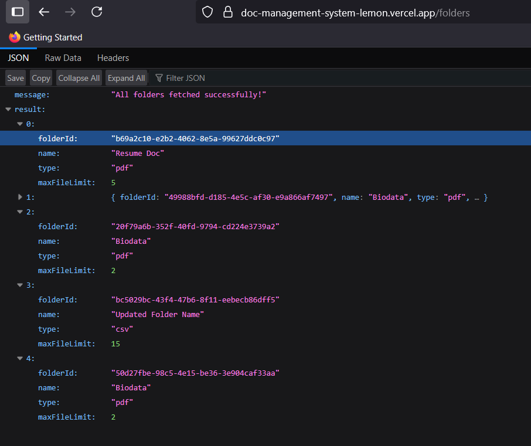
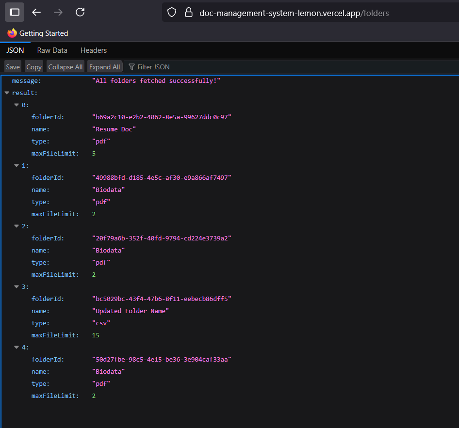
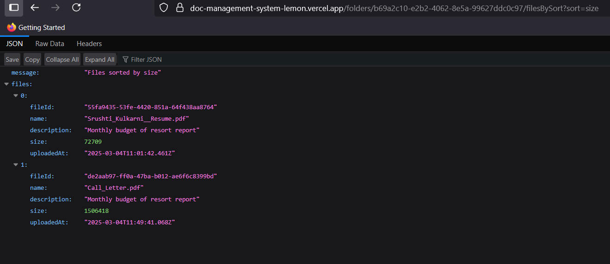
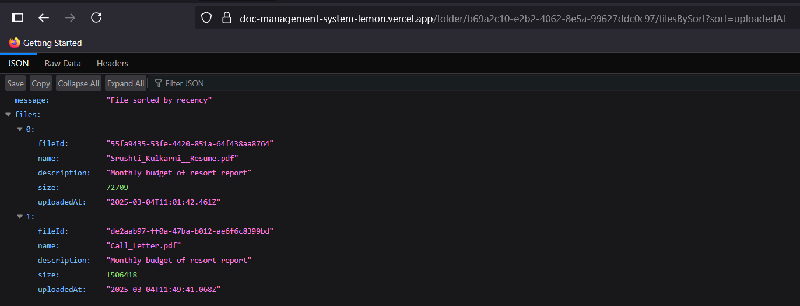

📁 Document Management System

🚀 Project Overview

This API-based Document Management System allows users to create folders with restrictions, upload files with metadata, and manage their files and folders efficiently. It securely stores files in Cloudinary and uses a PostgreSQL database with Sequelize for data management.

🛠️ Tech Stack

✨ Features & Capabilities

    🆕 Create, update, delete folders with file type and size restrictions

    📁 Upload single/multiple files with metadata (file description, type, etc)

    🔍 Retrieve files by folder, type, or sort by recency

    📝 Update file descriptions

    🗑️ Delete files or folders

    🔒 Store and retrieve files from Cloudinary with secure access

⚙️ Setup Instructions

    Clone the repo:
       git clone https://github.com/yourusername/document-management-system.git
       cd document-management-system

    Install dependencies:
       npm install

    Set up .env file in the root folder:
      PORT=3000
      DATABASE_URL=your_supabase_postgres_url
      CLOUDINARY_CLOUD_NAME=your_cloud_name
      CLOUDINARY_API_KEY=your_api_key
      CLOUDINARY_API_SECRET=your_api_secret

    Run the project:
     npm run dev

📝 API Endpoints Overview

| Method     | Endpoint                            | Description                  |
| ---------- | ----------------------------------  | ---------------------------- |
| ➕ POST    | `/folder/create`                   | Create new folder            |
| ✏️ PUT     | `/folders/:folderId`               | Update folder details        |
| 🗑️ DELETE  | `/folders/:folderId`               | Delete folder                |
| 📤 POST    | `/folders/:folderId/files`         | Upload file to folder        |
| ✏️ PUT     | `/folders/:folderId/files/:fileId` | Update file description      |
| 🗑️ DELETE  | `/folders/:folderId/files/:fileId` | Delete a file                |
| 📂 GET     | `/folders`                         | Get all folders              |
| 📄 GET     | `/folders/:folderId/files`         | Get files inside a folder    |
| 🔃 GET     | `/folders/:folderId/filesBySort`   | Get files sorted by criteria |
| 🔎 GET     | `/files`                           | Get files filtered by type   |

